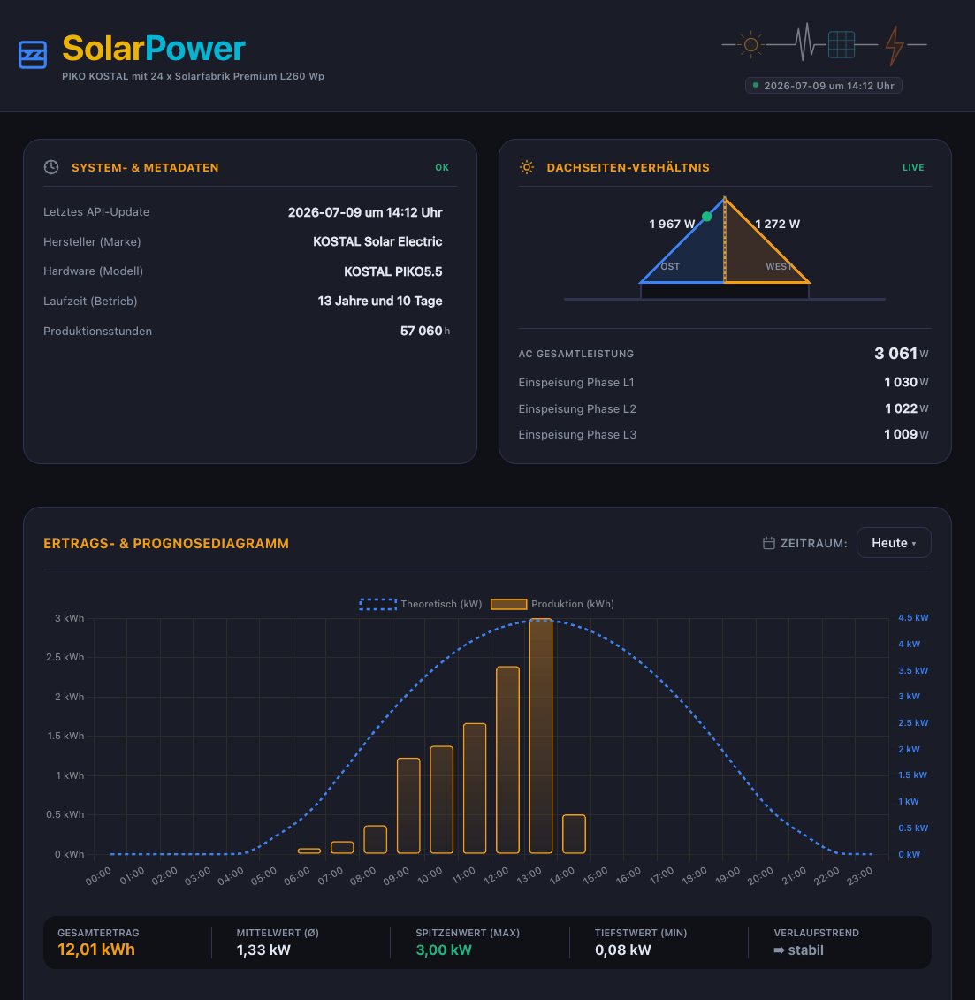

# ☀️ home-picokostal (hc_pico)

[](https://github.com/zibous/hc_pico/releases)
[](https://github.com/zibous/hc_pico)
[](https://python.org)
[](https://fastapi.tiangolo.com)
[](https://docs.pydantic.dev)
[](https://hub.docker.com)
[](https://mqtt.org)
[](https://www.home-assistant.io)
[](https://sqlite.org)
[](https://www.chartjs.org)
[](https://jinja.palletsprojects.com)
[](#)
[](#)
[](#)
[](#)
[](https://www.buymeacoff.ee/zibous)

Kostal Piko 5.5 Wechselrichter Datenlogger. Pollt den Inverter alle 5 Minuten,
berechnet theoretische PV-Leistung, speichert in SQLite und publiziert via MQTT
an Home Assistant.



## Features

- Kostal Piko HTTP Scraping (alle 5 Min)
- Theoretische PV-Berechnung (Sonnenstand, Ost/West Panels)
- SQLite Datenbank (pv_readings + pv_history)
- MQTT Publishing + HA Discovery (YAML-basiert)
- FastAPI Dashboard mit Chart.js
- Jahresvergleich, Stundenwerte, Tageswerte
- Wirkungsgrad-Berechnung (Actual vs. Theoretical)
- HA Webhook Notifications

## ANLAGEN-DASHBOARD ARCHITEKTUR & DATENFLUSS

```bash

    +--------------------------------------------------------------------------+
    |                          BROWSER / FRONTEND (UI)                         |
    |                                                                          |
    |   [Dashboard HTML / JS] <---> [Charts / ApexCharts] <---> [Statistiken]  |
    +--------------------------------------------------------------------------+
                                      |
       HTTP Requests (GET)            |             JSON Responses (Validiert)
       -------------------------------+---------------------------------------
                                      v

    +--------------------------------------------------------------------------+
    |                            FASTAPI BACKEND                               |
    |                                                                          |
    |  [ Middlewares: CORS / No-Cache ]                                        |
    |                          |                                               |
    |                          v                                               |
    |  [ API Router (app/api/routes/*) ]                                       |
    |    ├── /api/current   -->  [current_router] ──┐                          |
    |    ├── /api/summary   -->  [summary_router] ──┼─> (Validierung via       |
    |    └── /api/chart/*   -->  [chart_router]   ──┘    Pydantic Schemas)     |
    +--------------------------------------------------------------------------+

                               |
                               v

    +--------------------------------------------------------------------------+
    |                         BUSINESS LOGIC SERVICES                          |
    |                                                                          |
    |  ┌──────────────────────────────┐  ┌──────────────────────────────────┐  |
    |  │       CurrentService         │  │          SummaryService          │  |
    |  │  • Live-Wechselrichter-Status│  │  • Zeitraum: Tag/Woche/Monat/Jahr│  |
    |  │  • WR-Wirkungsgrad & Verluste│  │  • Fairer Periodenvergleich      │  |
    |  │  • Netz-Symmetrie (AC Phase) │  │  • Historische CO2-Statistiken   │  |
    |  │  • Blindleistungs-Analyse    │  └──────────────────────────────────┘  |
    |  └──────────────────────────────┘                    |                   |
    |                  |                                   v                   |
    |                  v                        ┌──────────────────────────┐   |
    |  ┌──────────────────────────────┐         │       ChartService       │   |
    |  │     Umwelt- & PV-Physik      │         │  • Intervall-Aggregation │   |
    |  │  • CO2-Vermeidung (0.22kg)   │         │  • Lückenfüller-Logik    │   |
    |  │  • Baum-Äquivalente / E-Km   │         │  • Performance Ratio     │   |
    |  │  • Ost/West String-Ratio     │         └──────────────────────────┘   |
    |  └──────────────────────────────┘                        |               |
    +----------------------------------------------------------+---------------+
                   |                                           |
                   |                                           v
                   |                            ┌──────────────────────────┐
                   |                            │   app.core.solar_model   │
                   |                            │  (Astronomische Prognose)│
                   └──────────────────┬────────>│  • Sonnenstandskurve     │
                                      |         │  • Einstrahlung Ost/West │
                                      |         └──────────────────────────┘
                                      v
    +--------------------------------------------------------------------------+
    |                            DATEN- & CONFIG-LAYER                         |
    |                                                                          |
    |  ┌──────────────────────────────┐        ┌────────────────────────────┐  |
    |  │       app.core.config        │        │      SQLite Datenbank      │  |
    |  │  • KOSTAL_SENSOR (P_STC, etc)│        │      (Isoliertes WAL)      │  |
    |  │  • APP_NAME / APP_VERSION    │        │  • [pv_readings] (Live)    │  |
    |  │  • DB_PATH                   │        │  • [pv_history]  (Historie)│  |
    |  └──────────────────────────────┘        └────────────────────────────┘  |
    +--------------------------------------------------------------------------+
```

## Quick Start

```bash
source ../.venv/bin/activate
make install
make dev
```

Dashboard: http://10.1.1.119:5098/

## API Endpoints

| Endpoint | Beschreibung |
|----------|-------------|
| `GET /` | Dashboard (HTML) |
| `GET /api/health` | Health Check |
| `GET /api/appstatus` | Status für Übersichtsdashboard |
| `GET /api/current` | Aktuelle Messwerte (Live) |
| `GET /api/summary` | Zusammenfassung (Heute/Woche/Monat/Jahr) |
| `GET /api/chart/hour?date=YYYY-MM-DD` | Stundenwerte + Theoretische Kurve |
| `GET /api/chart/day?from=&to=` | Tageswerte |
| `GET /api/chart/month?from=&to=` | Monatswerte |
| `GET /api/chart/year` | Jahreswerte |
| `GET /data/payload.json` | Rohdaten (letzter Polling-Zyklus) |

## Projektstruktur

```
hc_pico/
├── app/
│   ├── main.py                         # Entry Point (Controller + Dashboard)
│   ├── core/
│   │   ├── config.py                   # Konfiguration aus .env
│   │   ├── logging.py                  # Logger
│   │   ├── mqtt.py                     # MQTT Client
│   │   └── webhook.py                  # HA Webhook
│   ├── api/
│   │   ├── server.py                   # FastAPI App (Dashboard API)
│   │   └── routes/health.py            # /api/health + /api/appstatus
│   ├── integrations/kostal/
│   │   └── piko_sensor.py              # Kostal Inverter HTTP Scraping + PV-Berechnung
│   └── services/
│       ├── controller.py               # Polling-Loop + MQTT Publish
│       ├── db_manager.py               # SQLite (pv_readings + pv_history)
│       ├── hadiscovery.py              # HA MQTT Discovery (aus YAML)
│       └── utillib.py                  # Hilfsfunktionen
├── config/
│   ├── kostal_sensors.yaml             # HA Discovery Sensor-Definitionen
│   └── pv_model.json                   # PV Modell Parameter
├── data/                               # DB + payload.json + history.json
├── frontend/index.html                 # Dashboard UI
├── .env
├── Dockerfile
├── docker-compose.yml
└── Makefile
```

## Konfiguration (.env)

```env
PORT=5098
KOSTALURL=http://10.1.1.80
KOSTALUSER=pvserver
KOSTALPASSWORD=...
MQTT_HOST=10.1.1.119
MQTT_TOPIC=kostal/data
DATA_DELAY=300
PV_ETA=0.91
PV_SHIFT_OST=-1.0
PV_SHIFT_WEST=1.0
```

## Makefile

```bash
make dev        # Lokal mit DEBUG
make run        # Lokal normal
make build      # Docker Image
make up         # Docker starten (Port 5098)
make down       # Docker stoppen
make rebuild    # Rebuild ohne Cache
make logs       # Logs anzeigen
make backup     # DB Backup
```

## Docker

```bash
make build      # Image bauen
make up         # Container starten
make logs       # Logs anzeigen
make rebuild    # Rebuild ohne Cache
```

## Nginx Reverse Proxy

```nginx
location /dashboardpico/ {
    proxy_pass http://10.1.1.119:5098/;
    proxy_set_header Host $host;
    proxy_set_header X-Real-IP $remote_addr;
    proxy_set_header X-Forwarded-For $proxy_add_x_forwarded_for;
    proxy_set_header X-Forwarded-Proto $scheme;
}
```

